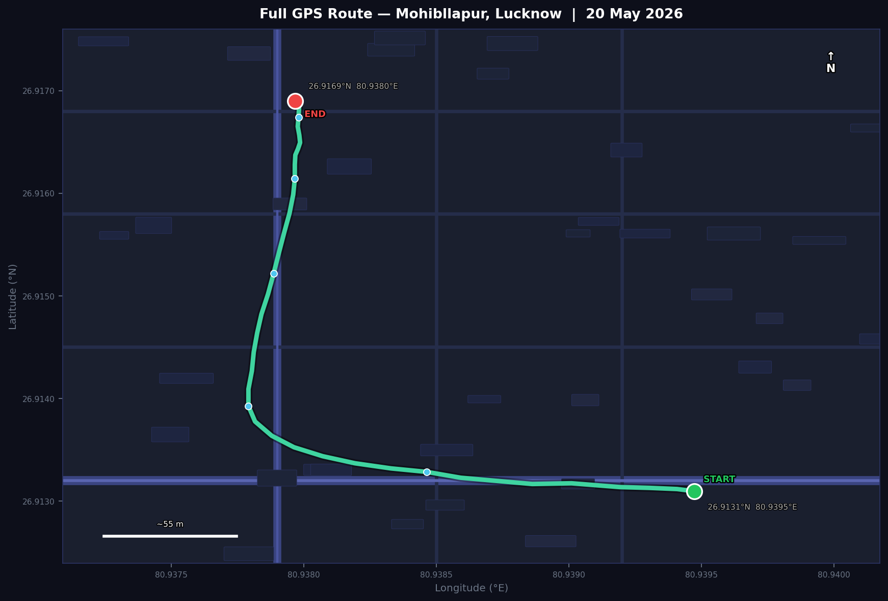
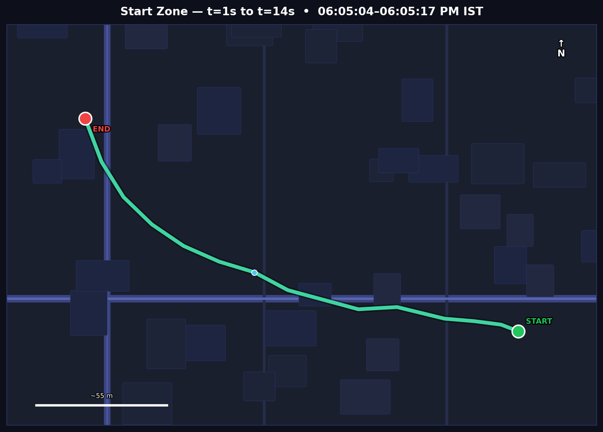
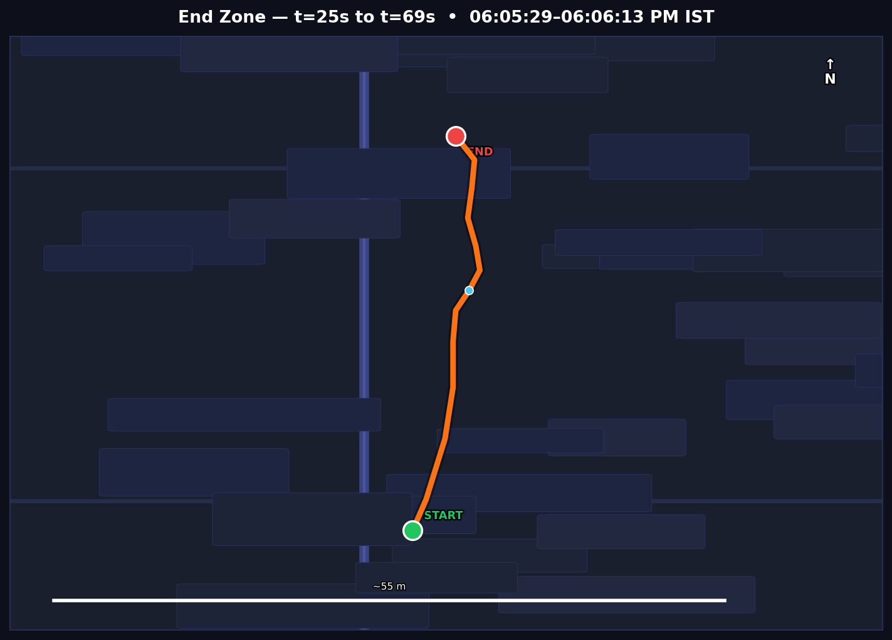
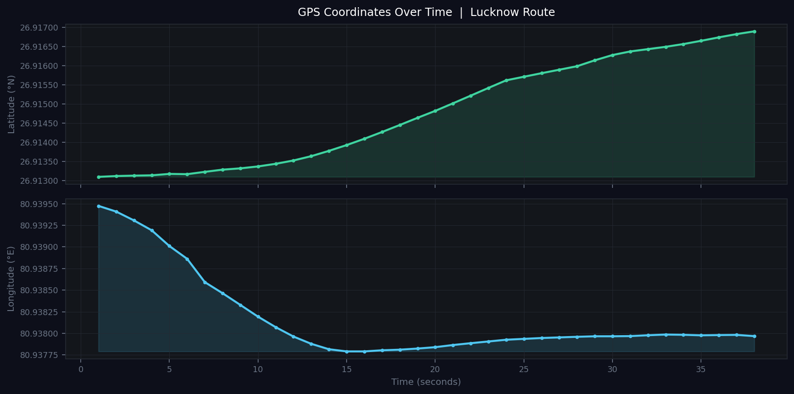

# 🛰️ GPS Track Extractor — GPSMapCamera MP4

> Extracts continuous GPS coordinates burned as overlay text into video frames recorded with the **GPSMapCamera** Android app. Outputs a clean CSV, interactive map, and time-series charts — no GPS metadata required.

---

## 📍 Sample Video Details

| Field | Value |
|---|---|
| **File** | `Eng_clg_60504PMByGPSMapCamera.mp4` |
| **Location** | Mohibllapur, Lucknow, Uttar Pradesh, India |
| **Date** | Wednesday, 20 May 2026 |
| **Start time** | 06:05:04 PM IST (UTC+05:30) |
| **End time** | 06:06:13 PM IST |
| **Duration** | 69 seconds |
| **Resolution** | 1088 × 1440 px |
| **FPS** | 29.97 |
| **File size** | ~127 MB |

---

## 🗺️ Route Map

The full GPS track extracted from the video — vehicle travels east-to-west initially then turns sharply northward along Mohibllapur road.



> 🟢 **START** — 26.9131°N, 80.9395°E &nbsp;|&nbsp; 🔴 **END** — 26.9169°N, 80.9380°E &nbsp;|&nbsp; Total distance: **~445 m**

---

## 🔍 Zone Detail Maps

| Departure Zone (t = 1s – 14s) | Arrival Zone (t = 25s – 69s) |
|---|---|
|  |  |
| East-to-West along main road | North-South travel along road |
| 06:05:04 → 06:05:17 PM | 06:05:29 → 06:06:13 PM |

---

## 📸 Sample Video Frame

The GPS overlay is burned directly into each frame by the GPSMapCamera app:


The overlay (bottom third of frame) contains:
- City / address name
- Lat/Lon coordinates: `Lat 26.913136° Long 80.939192°`
- Date and time: `Wednesday, 20/05/2026 06:05:09 PM GMT +05:30`

---

## 📈 GPS Coordinates Over Time



- **Latitude** rises steadily from 26.9131 → 26.9169 (northward movement, ~420 m)
- **Longitude** drops sharply in the first 15 seconds (initial west turn) then stabilises near 80.9380

---

## 🔧 How It Works

GPS data is **not stored in MP4 metadata** — it is drawn as visible text on each video frame. Standard tools like `exiftool` and `ffprobe` cannot read it. This pipeline reads it using OCR.

```
MP4 Video
    │
    ▼
[1] ffmpeg — extract 1 frame/sec, crop bottom third (GPS overlay region)
    │
    ▼
[2] Pillow — boost contrast 2×, convert to grayscale
    │
    ▼
[3] Tesseract OCR — read text from each frame (--psm 6 --oem 3)
    │
    ▼
[4] Regex — extract Lat XX.XXXXXX° Long XX.XXXXXX° + timestamp
    │
    ▼
[5] Pandas — clean outliers, linear interpolation for missed frames
    │
    ▼
CSV + HTML map + charts
```

**ffmpeg crop filter used:**
```bash
fps=1,crop=iw:ih/3:0:2*ih/3
```
This extracts 1 frame per second and crops only the bottom third of each frame where the GPS overlay appears — making OCR much faster and more accurate.

**Regex pattern:**
```python
r'[Ll]at\s*([+-]?\d{1,3}[.,]\d+)[°]?\s*[Ll]o?n?g?\s*([+-]?\d{1,3}[.,]\d+)[°]?'
```

---

## 🛠️ Tools & Dependencies

### System (install once)

```bash
# Ubuntu / Debian / Google Colab
sudo apt-get install -y tesseract-ocr ffmpeg

# macOS
brew install tesseract ffmpeg

# Windows
# Tesseract: https://github.com/UB-Mannheim/tesseract/wiki
# ffmpeg:    https://ffmpeg.org/download.html
```

### Python packages

```bash
pip install pytesseract Pillow opencv-python-headless pandas numpy folium matplotlib tqdm
```

| Package | Version | Purpose |
|---|---|---|
| `pytesseract` | ≥ 0.3 | Python wrapper for Tesseract OCR |
| `Pillow` | ≥ 9.0 | Image loading and enhancement |
| `opencv-python-headless` | ≥ 4.0 | Video frame reading |
| `pandas` | ≥ 1.5 | DataFrame, interpolation, CSV export |
| `numpy` | ≥ 1.23 | Numerical operations |
| `folium` | ≥ 0.14 | Interactive Leaflet.js map |
| `matplotlib` | ≥ 3.5 | Time-series charts |
| `tqdm` | ≥ 4.0 | Progress bars in notebooks |

---

## 🚀 Quick Start

### 1. Clone / download the project

```bash
git clone https://github.com/your-username/gps-track-extractor
cd gps-track-extractor
```

### 2. Place your video

```
gps-track-extractor/
├── Eng_clg_60504PMByGPSMapCamera.mp4   ← put your video here
├── GPS_Extractor_Final.ipynb
├── timestamp_to_seconds.ipynb
└── README.md
```

### 3. Run the notebook

```bash
jupyter notebook GPS_Extractor_Final.ipynb
```

Run all cells top to bottom. The only thing you need to change is:

```python
# Cell 4 — Configuration
VIDEO_PATH = 'Eng_clg_60504PMByGPSMapCamera.mp4'   # ← update this
```

### 4. Or run as a Python script

```python
import subprocess, os, re, pandas as pd, numpy as np
import pytesseract
from PIL import Image, ImageEnhance

VIDEO   = 'your_video.mp4'
FRAMES  = 'frames_temp'
OUTPUT  = 'gps_track.csv'

os.makedirs(FRAMES, exist_ok=True)

# Extract frames
subprocess.run([
    'ffmpeg', '-i', VIDEO,
    '-vf', 'fps=1,crop=iw:ih/3:0:2*ih/3',
    f'{FRAMES}/frame_%04d.jpg', '-y', '-loglevel', 'error'
])

# OCR each frame
LAT_LON = re.compile(
    r'[Ll]at\s*([+-]?\d{1,3}[.,]\d+)[°]?\s*[Ll]o?n?g?\s*([+-]?\d{1,3}[.,]\d+)[°]?'
)
records = []
for i, f in enumerate(sorted(os.listdir(FRAMES))):
    img  = Image.open(f'{FRAMES}/{f}')
    img  = ImageEnhance.Contrast(img).enhance(2.0).convert('L')
    text = pytesseract.image_to_string(img, config='--psm 6 --oem 3')
    m    = LAT_LON.search(text)
    records.append({
        'second'   : i + 1,
        'latitude' : float(m.group(1)) if m else None,
        'longitude': float(m.group(2)) if m else None,
    })

df = pd.DataFrame(records)
df['latitude']  = df['latitude'].interpolate()
df['longitude'] = df['longitude'].interpolate()
df.to_csv(OUTPUT, index=False)
print(f'Saved {len(df)} GPS points → {OUTPUT}')
```

---

## 📂 Output Files

| File | Description |
|---|---|
| `gps_track.csv` | 69 GPS points — second, latitude, longitude, datetime |
| `gps_track_with_timestamps.csv` | Enriched CSV with `elapsed_sec` and `unix_timestamp` |
| `gps_map.html` | Interactive Leaflet.js map (open in browser) |
| `gps_track_viewer.html` | Standalone dark-theme viewer with map + table + sparklines |
| `gps_timeseries.png` | Lat/lon time-series chart |
| `GPS_Extractor_Final.ipynb` | Full 17-cell Jupyter notebook |
| `timestamp_to_seconds.ipynb` | 9-cell notebook: parse timestamps → elapsed_sec / unix |
| `GPS_Extraction_Clean.pptx` | 11-slide presentation |

---

## 📋 CSV Format

**File:** `gps_track.csv`

```
second,latitude,longitude,datetime_utc530
1,26.913096,80.939474,"Wednesday, 20/05/2026 06:05:04 PM GMT +05:30"
2,26.913117,80.939408,"Wednesday, 20/05/2026 06:05:05 PM GMT +05:30"
3,26.913117,80.939408,
4,26.913128,80.939306,"Wednesday, 20/05/2026 06:05:07 PM GMT +05:30"
...
69,26.916897,80.937968,"Wednesday, 20/05/2026 06:06:13 PM GMT +05:30"
```

| Column | Type | Description |
|---|---|---|
| `second` | int | Frame number / time offset in video (1–69) |
| `latitude` | float64 | Decimal degrees North — 6 d.p. ≈ 0.1 m precision |
| `longitude` | float64 | Decimal degrees East — 6 d.p. ≈ 0.1 m precision |
| `datetime_utc530` | string | Timestamp from overlay (IST = UTC+05:30) |

**Enriched file** `gps_track_with_timestamps.csv` adds:

| Column | Type | Description |
|---|---|---|
| `time_IST` | string | `HH:MM:SS` format |
| `elapsed_sec` | float | Seconds since first GPS point (t=0) |
| `unix_timestamp` | float | Unix epoch seconds (UTC), usable in GIS / JS |

---

## 📊 Results Summary

| Metric | Value |
|---|---|
| Total GPS points | 69 |
| OCR read directly | 67 (97%) |
| Linearly interpolated | 2 (3%) |
| Start coordinates | 26.913096°N, 80.939474°E |
| End coordinates | 26.916897°N, 80.937968°E |
| Latitude change | +0.0038° (≈ 420 m northward) |
| Longitude change | −0.0015° (≈ 130 m westward) |
| Total distance (Haversine) | ≈ 445 m |
| Duration | 69 seconds |
| Average speed | ≈ 6.5 km/h |

---

## 📓 Notebooks

### `GPS_Extractor_Final.ipynb` — 17 cells

| Cell | Description |
|---|---|
| 1 | Install Tesseract + ffmpeg (system) |
| 2 | Install Python packages |
| 3 | Import libraries |
| 4 | **Configuration** — set `VIDEO_PATH` here |
| 5 | Inspect video metadata |
| 6 | Extract frames with ffmpeg |
| 7 | Preview sample frames |
| 8 | OCR loop — extract GPS from every frame |
| 9 | Clean data & interpolate missing values |
| 10 | Haversine distance & speed calculation |
| 11 | Save to CSV |
| 12 | Print full GPS table |
| 13 | Lat/Lon time-series chart |
| 14 | Cumulative distance chart |
| 15 | Interactive Folium map |
| 16 | Final summary report |
| 17 | Optional cleanup |

### `timestamp_to_seconds.ipynb` — 9 cells

Parses the raw overlay timestamp into:
- `datetime` (Python, timezone-aware IST)
- `elapsed_sec` — seconds from first GPS point
- `unix_timestamp` — Unix epoch seconds (UTC)

Handles both OCR format variants found in the video:

```
Wednesday, 20/05/2026 06:05:04 PM GMT +05:30   ← full format
20/05/2026 06:05:10 PM                          ← short format (partial OCR read)
```

---

## 🔄 Adapting for Other Videos

To use this pipeline on a different GPSMapCamera video:

1. Update `VIDEO_PATH` in Cell 4 of the notebook
2. If the overlay is in a different position, adjust the ffmpeg crop filter in Cell 6:
   - Bottom third: `crop=iw:ih/3:0:2*ih/3`
   - Bottom quarter: `crop=iw:ih/4:0:3*ih/4`
3. If the coordinates are outside India, update the outlier bounds in Cell 9:
   ```python
   LAT_MIN, LAT_MAX = your_min_lat, your_max_lat
   LON_MIN, LON_MAX = your_min_lon, your_max_lon
   ```
4. Adjust `FPS_EXTRACT` (default: 1) for higher time resolution if needed

---

## ⚠️ Limitations

- OCR accuracy depends on video quality — motion blur or heavy compression may reduce read rate
- The pipeline assumes GPSMapCamera's standard overlay layout (bottom third of frame)
- Interpolation introduces small errors for frames where GPS was missed — typically < 1 m
- Processing speed: ~3 minutes for a 69-second video on a standard laptop

---

## 📄 License

MIT License — free to use, modify and distribute.

---

## 🙏 Acknowledgements

- [Tesseract OCR](https://github.com/tesseract-ocr/tesseract) — Google's open-source OCR engine
- [ffmpeg](https://ffmpeg.org) — video frame extraction
- [Folium](https://python-visualization.github.io/folium/) — interactive maps
- [OpenStreetMap](https://www.openstreetmap.org) — map tiles

---

*Generated from `Eng_clg_60504PMByGPSMapCamera.mp4` · Lucknow, UP, India · 20 May 2026*
